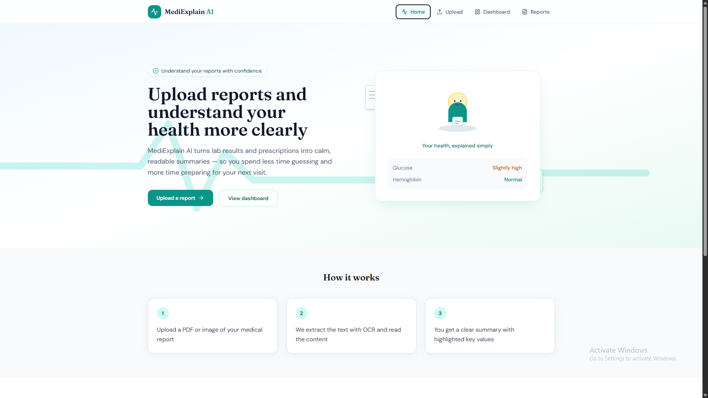
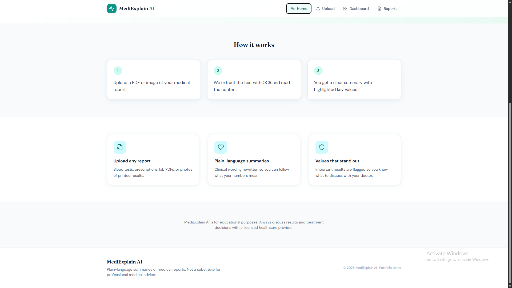
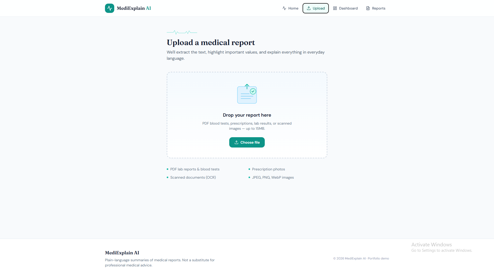
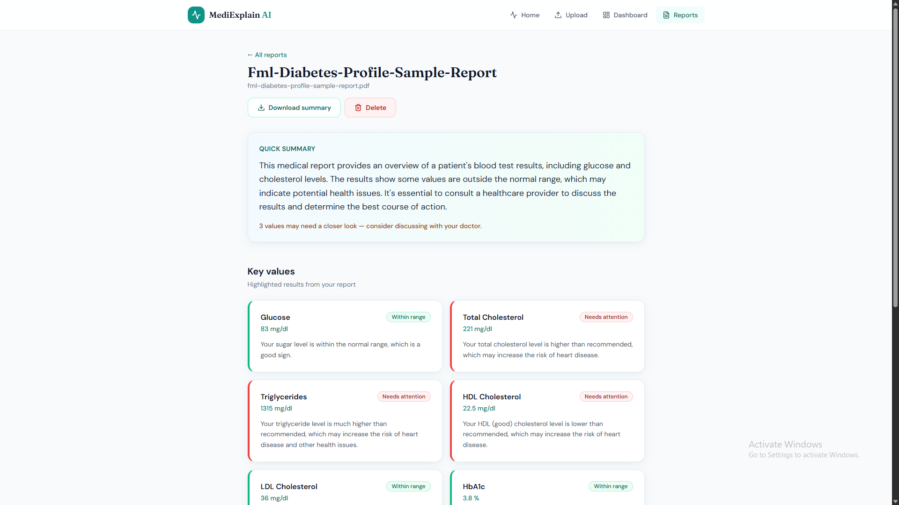
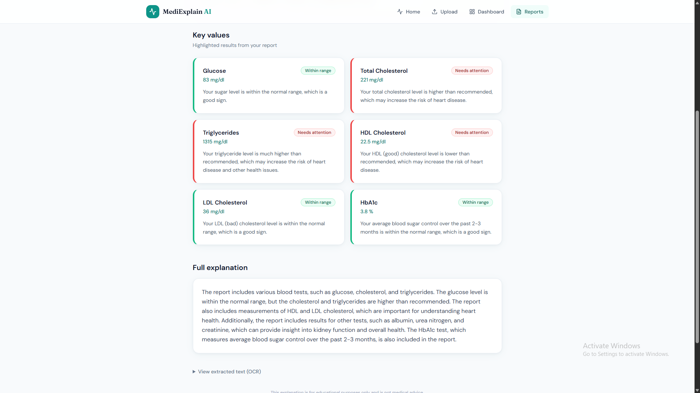
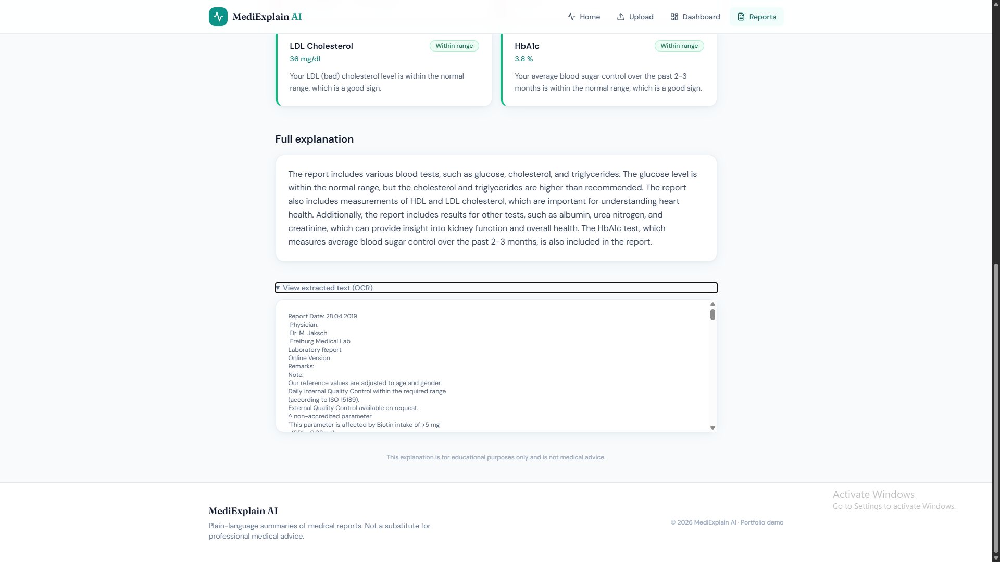
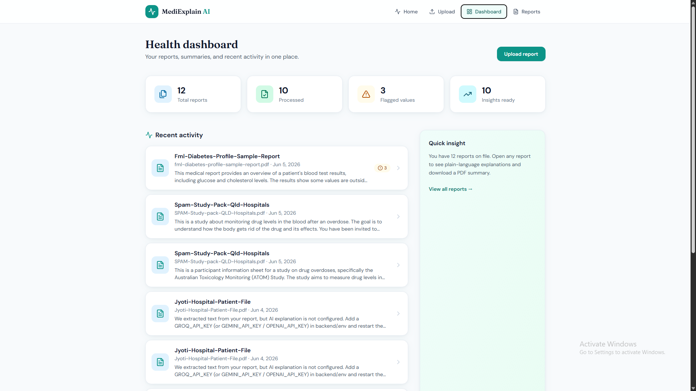

# MediExplain AI

Medical report analysis platform that uses OCR and LLM-based explanations to simplify healthcare reports into plain human language.

Upload PDFs or images of lab results, prescriptions, and scans — get OCR extraction, AI-generated explanations, highlighted values, and downloadable summaries.

---

## Problem

Medical reports are often difficult for non-medical users to understand due to complex clinical terminology and confusing test values.

MediExplain AI simplifies healthcare reports using OCR and AI-generated explanations written in everyday language, helping users better understand their medical documents.

---

## Key Highlights

* OCR-powered medical report extraction
* AI-generated plain-language explanations
* Abnormal value detection and highlighting
* FastAPI async backend architecture
* React + Tailwind responsive frontend
* PDF summary generation
* Groq LLM integration
* SQLite + SQLAlchemy async ORM

---

## Features

### Medical Report Upload

* Drag-and-drop PDF and image uploads
* File preview cards
* Support for prescriptions, lab reports, and scans

### OCR Text Extraction

* Tesseract OCR for images
* PDF text extraction
* OCR fallback for scanned PDFs

### AI Medical Report Explainer

* Groq (default), Gemini, or OpenAI integration
* Converts clinical language into simple explanations
* Human-friendly health summaries

Example:

> “Glucose exceeds normal range”

becomes:

> “Your sugar level is slightly higher than normal.”

### Value Highlights

* Normal / borderline / abnormal badges
* Important medical values summarized into cards
* Quick insights for easier understanding

### Health Dashboard

* Uploaded reports history
* Recent activity tracking
* Quick health insights

### Download Summary

* Export AI-generated summaries as PDF

---

## How It Works

1. User uploads a medical report
2. OCR extracts report text
3. AI analyzes extracted content
4. Important values are highlighted
5. Plain-language explanation is generated
6. Summary can be downloaded as PDF

---

## Tech Stack

| Layer    | Technology                            |
| -------- | ------------------------------------- |
| Frontend | React, TypeScript, Tailwind CSS, Vite |
| Backend  | FastAPI, Python 3.11+                 |
| Database | SQLite (async via SQLAlchemy)         |
| OCR      | Tesseract, pypdf, pdf2image           |
| AI       | Groq, Google Gemini, or OpenAI        |

---

## Architecture

```text
Frontend (React + Tailwind)
        ↓
FastAPI Backend
        ↓
OCR Engine (Tesseract)
        ↓
Groq / Gemini / OpenAI
        ↓
SQLite Database
```

---

## Project Structure

```text
medexplain-ai/
├── frontend/
│   └── src/
│       ├── api/
│       ├── components/
│       ├── pages/
│       └── types/
│
├── backend/
│   ├── app/
│   │   ├── ai/
│   │   ├── api/routes/
│   │   ├── models/
│   │   ├── schemas/
│   │   └── services/
│   │
│   └── uploads/
│
├── screenshots/
│
└── README.md
```

---

## Screenshots

### Home Page





---

### Upload Page



---

### Report Analysis







---

### Dashboard



---

## Prerequisites

* Node.js 18+
* Python 3.11+
* Tesseract OCR installed on your system

### Install Tesseract

#### Windows

Install from:

https://github.com/UB-Mannheim/tesseract/wiki

Add Tesseract to PATH after installation.

#### macOS

```bash
brew install tesseract
```

#### Linux

```bash
sudo apt install tesseract-ocr
```

Optional:
Install Poppler for scanned PDF OCR support.

---

## Setup

### Backend

```bash
cd backend

python -m venv venv

# Windows
venv\Scripts\activate

# macOS/Linux
# source venv/bin/activate

pip install -r requirements.txt

# Windows
copy .env.example .env

# macOS/Linux
# cp .env.example .env

# Add your API key in .env
# GROQ_API_KEY=your_key

python run.py
```

---

### Frontend

```bash
cd frontend

npm install
npm run dev
```

Open:

```text
http://localhost:5173
```

---

## Environment Variables

| Variable       | Description                      |
| -------------- | -------------------------------- |
| GROQ_API_KEY   | Groq API key (default provider)  |
| GROQ_MODEL     | Example: llama-3.3-70b-versatile |
| GEMINI_API_KEY | Optional Gemini API key          |
| OPENAI_API_KEY | Optional OpenAI API key          |
| AI_PROVIDER    | groq / gemini / openai           |
| DATABASE_URL   | SQLite database path             |
| UPLOAD_DIR     | Upload storage folder            |
| CORS_ORIGINS   | Allowed frontend origins         |

Without an API key:

* OCR still works
* AI explanations fallback to demo mode

---

## API Endpoints

| Method | Endpoint                    | Description             |
| ------ | --------------------------- | ----------------------- |
| GET    | /api/health                 | Health check            |
| POST   | /api/reports/upload         | Upload & process report |
| GET    | /api/reports                | List reports            |
| GET    | /api/reports/dashboard      | Dashboard statistics    |
| GET    | /api/reports/{id}           | Report detail           |
| GET    | /api/reports/{id}/download  | Download PDF summary    |
| POST   | /api/reports/{id}/reprocess | Re-run AI analysis      |
| DELETE | /api/reports/{id}           | Delete report           |

---

## Future Improvements

* Multi-language report explanations
* Voice-based healthcare assistant
* Medicine reminder system
* Authentication and user accounts
* AI health trend analysis
* Doctor consultation integration

---

## Disclaimer

MediExplain AI is an educational and portfolio project designed to simplify medical report understanding using OCR and AI technologies.

The platform does not provide medical diagnosis, treatment, or professional healthcare advice. Users should always consult qualified healthcare professionals regarding medical decisions.

---

## Author

Abhi Goswami

GitHub:
https://github.com/goswami-abhi
